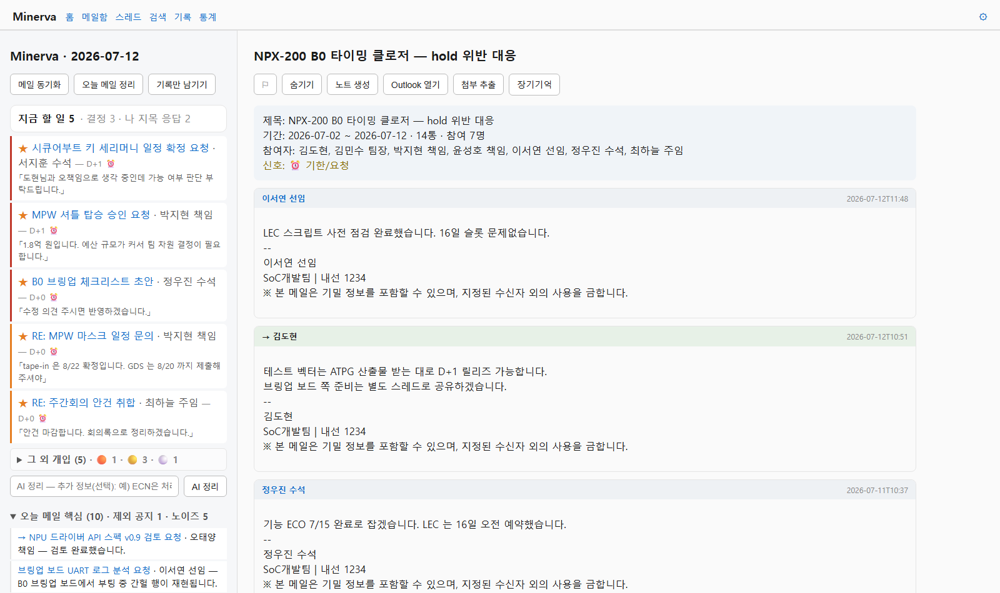
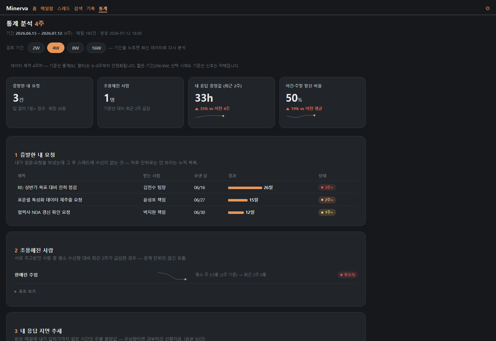

# mailkb — Outlook 위의 기억 계층

> **EN** — *mailkb* ("Minerva") is a personal knowledge layer on top of classic Outlook (COM, Windows):
> it indexes mail into SQLite/FTS5, distills daily decisions into a human-approved long-term ledger,
> and serves a local web UI — **Python stdlib only**, AI strictly opt-in via CLI subprocess. Korean-first.

**mailkb = mail knowledge base** (메일 지식 베이스). 메일을 읽는 클라이언트가 아니라,
메일을 지식으로 축적·색인·검색하는 계층이라는 뜻.

| 홈 · 지금 할 일 · 스레드 (라이트) | 통계 신호 대시보드 (다크) |
|---|---|
|  |  |
*(화면은 합성 데모 데이터 — 가상 팹리스 '누리소프트'의 1개월치 메일 189통)*

메일 클라이언트가 아니다. 읽고 쓰는 것은 지금처럼 Outlook에서 하고,
mailkb는 Outlook이 못 하는 것만 한다: **아카이브 인덱스, 스레드 지식화, 하루 끝 회고, "지금 할 일" 큐.**


- 코어는 Python 표준 라이브러리만 사용 (Windows에서는 pywin32 하나 추가)
- AI는 opt-in — `--ai` 없이는 네트워크 호출 자체가 없음
- AI 호출은 opencode(사내 LLM)/claude headless CLI에 subprocess로 위임 — SDK·API 키 불필요

## 구조

```
Outlook(원본, hot) ──COM──> sync ──> SQLite(인덱스: 메타+신규내용+FTS+누적요약
                                        │        +장기기억 decisions)
                              ls / search / thread / review / serve(웹)
                                        │
                              vault/ (마크다운 지식 볼트)
                                ├─ daily/   데일리 리뷰 (수확 결과 포함)
                                └─ notes/   큐레이션 노트 (+ 첨부 추출)
```

- 원본·첨부는 Outlook에 그대로 — `GetItemFromID`(EntryID)로 O(1) 참조, 실패 시 Message-ID로 재검색
- **HTML 본문은 마크다운으로 변환**(`html_to_markdown`) — 굵게/기울임/링크/표/목록 보존. `item.Body`(서식 없는 평문) 대신 `HTMLBody` 우선. Word/Outlook 의 `<span style=font-weight:bold>` 식 굵게도 포착
- 인용 제거로 "새로 쓰인 부분"만 인덱싱 (합성 189통 실측 절감 90%) — 검색 품질과 AI 토큰 양쪽의 핵심
- 노이즈 필터: `ignore_senders`(noreply/JIRA/빌드) + `internal_domains`(외부 스팸) + `blocked_senders.txt`(`block` 으로 누적) — 미답변·기한·요약·개입 큐에서 제외. `noise` 로 발신자별 후보를 보고 `block`, **실제 수신 차단은 Outlook 규칙으로 병행**
- 미답변·기한 신호는 To 3인 미만만 — 단체 공지(수신 50명 전사 메일 포함)의
  "회신 바랍니다"·"금일 18시까지" 류가 개인 액션 목록을 오염시키지 않음
- 신호는 SQL/규칙(결정론)로 추출하고 AI 는 그 위의 판단만 — AI 실패 시에도 기본 동작 유지(graceful)

## 데모 (아무 데서나, Outlook 불필요)

```bash
python3 -m mailkb --home ./demo init
python3 -m mailkb --home ./demo sync --source fake --full
                                                 # fake 소스: 한국어 합성 메일 189통 (최근 1개월, SoC·AI·보안)
                                                 # (긴 스레드 12~14통, 수신50명 전사메일, 스팸, 시스템 노티,
                                                 #  정체·그룹결정 사례 포함)
python3 -m mailkb --home ./demo ls --unanswered
python3 -m mailkb --home ./demo act              # 지금 할 일 큐 (결정론)
python3 -m mailkb --home ./demo act --ai --note "ECN은 처리 중, 납기건 우선"
python3 -m mailkb --home ./demo review           # 결정론 리뷰 (AI 없음)
python3 -m mailkb --home ./demo review --ai      # 요약·수확=sonnet · 분류=haiku 자동 라우팅
python3 -m mailkb --home ./demo serve --open     # 웹 UI (브라우저 자동 열기, 아래 참고)
python3 -m unittest discover -s tests -p 'test_*.py'  # 단위 테스트 507건 (외부 의존 없음)
python3 tests/benchmark_wordmap.py --messages 5000   # 인물 어휘 fast/raw 성능·동등성
```

## 웹 UI — Minerva

`mailkb serve` 는 Outlook 유사 **좌/우 분할**의 로컬 웹 앱이다 — 왼쪽은 목록
(홈·메일함·스레드·인물·기억·설정), 오른쪽은 읽기 패널. 스레드를 열면
**분석(누적 요약·신호)이 위, 원문 타임라인이 아래**로 나온다.
브라우저가 한글·HTML 렌더를 담당하므로 OS 무관.

```
python -m mailkb serve --open     # http://127.0.0.1:8765 (브라우저 자동 열기)
python -m mailkb serve --app      # Edge 앱 모드 (주소창 없는 독립 창, Windows)
```

- **홈 = "지금 할 일"**: 결정론 개입 큐 4분류 — 🔴 결정 필요 / 🟠 회신 필요 /
  🟡 내가 넘긴 공(정체, 영업일) / ⚪ 멈춘 스레드. 나를 지목한 항목은 ★ 우선.
  아래에 오늘 메일 핵심(업무 스레드 한 줄씩)과 장기기억 카운트.
- **메일함·스레드 공통 필터 탭**: 전체 · 미개봉 · ↩ 회신 필요 · ⏰ 기한 ·
  🚩 플래그 · 🙈 숨김. 열람 시 읽음(볼드 해제), 키보드 `j/k` 이동 · `x` 신호 끄기·복원
  · `f` 플래그 · `h` 숨김 · `/` 검색(선택 행 토글, 상태명 토스트, 필터 바 오른쪽 ⓘ 안내),
  스크롤 추가 로딩, 자동 동기화(기본 30분 — 새 메일 오면 토스트).
- **데일리 리뷰 (결정론 자동 + AI 요약)**: 결정론 리뷰(개입 분류·핵심·인물 지표)는
  **버튼 없이 자동** — 오늘 홈/데일리를 열 때 새 메일이 있으면 배경에서 재생성하고
  페이지를 조용히 갱신한다(lazy-on-view, 사용성 무해). 그 위에 **AI 요약**(데일리
  페이지 버튼)을 얹으면 AI 7단계 — 누적 요약 갱신 → **결정·신호 수확** → 핵심 한 줄
  → 개입 분류 → 우선순위 주석 → **하루 요약** → **인물 요약 갱신**. 대기 화면에
  진행 바(단계 i/7)와 애니메이션. 하루 이틀 건너뛰어도 다음 실행이 소급한다(워터마크).
- **장기기억 (결정의 영구 기억)**: 수확이 메일 원문에서 결정을 추출해 **반영 대기**
  초안으로 올리고(원문 인용 검증 — 환각 차단), **반영/유보는 사람이 결정**한다
  (기억 › 장기기억). 스레드의 `장기기억` 버튼으로 수동 기록(즉시 반영).
  반영된 것만 검색·회고 재료가 된다.
- **기억**: 데일리(◀ ▶ 날짜 이동) · 장기기억(반영/유보 목록·검색·상호 복구).
- **인물 도시에**: 최근 6개월 교류 강도순 인물 목록 → 사람별 카드(관계 수치·진행 중·
  서로의 미결·관여한 결정·최근 변화·**업무 어휘 지도**). 이미 추출된 메일·액션·결정·신호를
  사람 중심으로 재조립한 결정론 화면. '관계 수치'는 **시각화** — 주고받기 균형 막대·
  회신 속도 비교 막대·주별 교신 스파크라인으로 교환 방향·응답성·추세를 한눈에.
  '업무 어휘 지도'는 본인 발신 메일의 6개월 문서 빈도와 다른 인물 대비 점수로
  반복 구문·연관어·최근 상승어·함께 언급된 사람을 근거 스레드와 함께 보여준다.
  `--ai` 시 맨 위에 **AI 요약 카드**(역할·
  지금 함께 하는 일·병목)가 얹히는데, 각 줄의 인용을 본문에 대조 검증해 근거 없는 주장은
  버린다(환각 차단). 스레드에서 이름 클릭으로도 진입.
- **통계**: 기간(2/4/8/16주) 이메일 분석 대시보드 — 상단 지표 타일(주간 발신·수신 ·
  내 응답 중앙값 · 야간/주말 비율) 아래 6섹션: ①발신/수신 볼륨 추세 ②요일×시간
  활동 히트맵 ③응답 시간(나/상대 중앙값 + 답 대기 목록) ④받은 메일 구성(스팸·공지·
  참조·직접) ⑤왕복 많은 논의(핑퐁) ⑥자주 주고받는 상대(관계 그래프 — **이름 클릭 시
  그 사람 메일 창으로**). 오픈소스/상용 이메일 통계의 표준 지표로 재구성(2026-07-13).
- **메일 표시**: HTML 본문은 정제 후 서식 렌더, 마크다운 텍스트 본문은 **서식이 기본**이고
  "텍스트 보기" 토글로 원문 확인 · 꼬리의 이미지 블록 서명(로고·명함 카드)은
  좁은 조건으로 감지해 "Signature 숨김" 한 줄로 접음.
- **설정**: 라이트/다크 테마(**Android식 세그먼트 토글**, 다크는 웜 코랄 — 다크에선
  메일 원본의 흰 배경 전제 색을 테마색으로 평탄화해 가독성 확보) · 판정 기준·노이즈 규칙
  런타임 편집 (`overrides.json` 에 영구 — config.toml 무손상).
- **스레드 조작**: 플래그 ⚐/⚑(정리 때 우선 수확·요약 문턱 면제) ·
  숨기기(목록·추적 제외 — **새 수신 메일 오면 자동 해제**) · 노트 생성 · 첨부 추출 ·
  Outlook 열기 · 발신자 차단(참여자 이름 클릭 → 주소별 화면).
- **보안**: stdlib `http.server`(의존성 0) · localhost 바인딩 · CSP(원격 이미지=추적
  픽셀 기본 차단, 인라인 스크립트 차단) · POST Origin 검사 · 메일 HTML 은 정제본만 렌더.
- **Windows**: 동기화·Outlook 열기는 COM — 단일 스레드 `HTTPServer` +
  `pythoncom.CoInitialize()` (로컬 1인 도구 전제).

## 회사 PC 배포 (Windows + 클래식 Outlook)

1. **Windows 네이티브 Python 3.11+** 설치 (WSL 불가 — COM 접근 필요)
2. `pip install pywin32` (프록시 필요 시 `--proxy` 옵션)
3. GitHub 에서 받기 (이후 갱신도 `git pull` 한 번):
   ```
   git clone https://github.com/dongjinpark-maker/mailkb
   cd mailkb
   python -m mailkb init          # 데이터는 코드 폴더 옆 <mailkb>\data\ 에 생성 (~/ 안 씀)
   ```
   `data/` 는 gitignore 라 pull 이 실데이터·설정을 건드리지 않는다.
4. `<mailkb>\data\config.toml` — **사내망 적용 설정** (리포·코드의 값은 전부 가상
   예시라, 실환경 값은 여기에만 넣는다. 다른 위치는 `--home`/`MAILKB_HOME`):
   - `my_addresses` → 실제 회사 주소. **메일 별칭(alias)으로도 발신한다면 별칭
     주소를 함께 나열** — 별칭 발신이 수신으로 오분류되는 것을 막는다
   - `my_names` → 내 이름/호칭 (예: `["홍길동", "길동"]`) — 본문이 나를 지목했는지
     판정해 그룹메일에서도 확인 대상으로 유지 (개입 큐 과탐 축소의 핵심)
   - `internal_domains` → 사내 도메인 — 설정하면 외부 도메인 발신은 노이즈로 제외
   - `[filters] subject_noise_strong` → **실제 사내 시스템의 제목 패턴을 직접 추가**
     (전자결재·알림·설문 등). 코드 기본값의 `[nflow]`/`[nwork]` 는 가상 예시라
     이 단계를 건너뛰면 실환경 결재·알림 필터가 동작하지 않는다
   - `[review] broadcast_to` → 조직 규모에 맞춰 조정. 기준: **실무 그룹 메일은
     포함되고 팀/전사 공지만 배제되는 값** — 예: 그룹 ~80명·팀 ~400명 조직이면
     50 (20~30명 실무 메일은 유지, 전체 발송만 배제)
   - `source` → **`init` 이 이미 `"outlook"` 로 생성** (데모만 `fake`)
   - `[ai.backends.internal]` cmd → 실제 사내 LLM CLI 호출 형태
   - 그 외 `[review]`: `stall_workdays`(내가 넘긴 공, 기본 2)·`stale_workdays`(멈춘
     스레드, 3)는 **영업일** 기준, `direct_to`(직접수신 판정, 4). `holidays` 엔
     대한민국 공휴일 2026(대체 포함) 기본 내장 — 음력 공휴일은 **연 1회 갱신**
5. 첫 수집 (Outlook 실행 상태에서):
   ```
   python -m mailkb sync          # 첫 실행 = 전체 백필 (메일함 크기에 따라 수 분)
   ```
6. 이후 증분 sync는 작업 스케줄러에 등록 (1~2시간 간격), review는 퇴근 전 수동 1회

### 실행 (Windows)

루트 배치 파일(mailkb.bat/sync.bat)은 2026-07-11 제거 — 전송 필터 문제로 명령을 직접 쓴다:

```
python -m mailkb serve --app       # Minerva 웹 UI (Edge 앱 모드, 실패 시 기본 브라우저)
python -m mailkb sync              # 증분 수집 (Outlook 실행 상태)
```

자동 sync 는 Windows 작업 스케줄러에 직접 등록한다 (등록 스크립트는 제거 —
필요 시 아래 한 줄이면 충분):

```
schtasks /Create /TN mailkb-sync /SC HOURLY /MO 2 ^
  /TR "cmd /c cd /d <mailkb 경로> && python -m mailkb sync"
schtasks /Run    /TN mailkb-sync     # 등록 직후 시험 실행 (Outlook 켠 상태에서 권장)
schtasks /Query  /TN mailkb-sync     # 확인
schtasks /Delete /TN mailkb-sync /F  # 해제
```
데이터 폴더가 코드 기준 고정(`<mailkb>\data`)이라 스케줄러가 다른 cwd로 실행해도 안전하다(빈 DB 생성 위험 없음).

### 아이콘으로 실행 (Minerva 앱처럼)

터미널 없이 바탕화면·작업표시줄 아이콘으로 연다. 리포의 **`launch_minerva.pyw`** 가
클릭 한 번에 ① 떠 있던 서버 종료 ② 서버 시작 ③ Edge 앱 창 열기까지 하고, **그 창을
닫으면 서버도 함께 내려간다**(콘솔 없음 — pythonw). 재시작·종료 버튼은 없다: 다시
아이콘을 누르면 새 서버로 뜬다.

**최신 코드 반영**은 매 실행마다 하지 않는다(시간 낭비) — **설정 › 최신으로 업데이트**
버튼(또는 터미널 `git pull`) 후 **창을 닫았다 다시 열면** 적용된다.

```
바로 가기 만들기
1. launch_minerva.pyw 우클릭 → 바로 가기 만들기 → 바탕화면/작업표시줄에 고정
2. 바로 가기 속성 → 대상을  pythonw.exe "<mailkb>\launch_minerva.pyw"  로,
   아이콘 변경 → 리포의 minerva.ico 지정
3. (더 앱 같은 설치) 창이 뜬 뒤 Edge 메뉴 → 앱으로 설치 →
   시작 메뉴·바탕화면에 파비콘 아이콘으로 등록
```

창-서버 수명은 **Edge 창 프로세스를 추적**해 묶는다(하트비트·폴링 없음 — CPU 0).
Edge 가 없으면 기본 브라우저로 열되 자동 종료는 적용되지 않는다(회사 PC는 Edge 전제).

### 신규 환경에서 확인할 것

- [ ] 보안 경고 팝업 여부 → 뜨면: 파일 > 옵션 > 보안 센터 > 프로그래밍 방식 액세스 확인
- [ ] Exchange 주소가 SMTP로 나오는지 (`mailkb ls`에서 발신자 주소 확인)
- [ ] `is_sent` 판별 정상 여부 (`→` 마크) — my_addresses 설정과 대조
- [ ] 증분 sync 속도 (`sync` 출력의 소요 시간)
- [ ] `mailkb open <번호>` 로 Outlook 원문 열기

## 명령

| 명령 | 설명 | AI |
|---|---|---|
| `sync [--full]` | 증분 수집 + 인용 제거 + 스레드/인물 파생 | ✗ |
| `ls [--unanswered\|--today]` | 목록 / 미답변 스레드 | ✗ |
| `search <질의>` | 전문검색 (FTS5 trigram) | ✗ |
| `show <번호>` / `thread <ID>` | 본문(인용 제거본) / 스레드 타임라인 | ✗ |
| `act [--ai --note ..]` | 지금 할 일 큐 (결정론 4분류; --ai 로 재분류·우선순위·주석) | 선택 |
| `review` | 데일리 리뷰: 머리 한 줄 통계 · **지금 할 일** · 오늘 흐름(스레드 한 줄, 중복 제외) · 참고 → vault/daily | ✗ |
| `review --ai` | + 누적 요약 갱신 + **결정·신호 수확(장기기억 제안)** + 핵심 AI 한 줄 + 할 일 분류·주석 + **하루 요약**(맨 위 3~5문장) | ✓ |
| `note <스레드ID>` | 지식 노트 템플릿 생성 (요지는 직접 기입) | ✗ |
| `noise [--limit N]` | 발신자별 수신량·차단 후보(일방/노이즈 표시) | ✗ |
| `block <주소>` / `unblock <주소>` | 발신자 제외 목록 관리 (Outlook 규칙과 병행) | ✗ |
| `hide <스레드ID> [--undo]` | 스레드 숨김/해제 (목록·추적 제외, 새 메일 오면 자동 해제) | ✗ |
| `open <번호>` | Outlook에서 원문 열기 (회사 PC) | ✗ |
| `attach <스레드ID>` | 스레드 첨부를 vault로 추출 — 큐레이션 시 Cold 보존 | ✗ |
| `serve [--port --open --app]` | Minerva 웹 UI (localhost 고정, 위 참고) | ✗ |
| `diagnose` | 진단: 스레딩·본문품질·요약 커버리지·AI 백엔드 응답·개입 큐 과탐 분해 | 선택 |
| `stats` | 저장소 통계 (절감률, DB 크기) | ✗ |

## 설계 결정 기록

- **Outlook = hot 저장소**: 로컬 보존 연한 제한 없음이 확인되어 .eml 복사 폐기. COM은 어차피 원본 MIME을 주지 않음(MAPI 저장)
- **EntryID + Message-ID 병행**: EntryID는 O(1)이지만 폴더 이동 시 변경 → Message-ID(영구)로 폴백
- **토큰 깔때기**: 필터 → 스레드화+인용 제거 → 롤링 요약 캐시(신규분만 갱신) → 하루 1회 분석. 150통/일 기준 월 커피값 이하
- **AI 백엔드 = subprocess**: 인증·프록시·모델 관리를 opencode/claude CLI에 위임
- **AI 산출은 초안, 확정은 사람**: 수확은 원문 인용 검증(환각 가드)을 통과한 것만 장기기억 '반영 대기'로 — 반영/유보는 사람이 결정. 분류·주석도 결정론 큐를 덮지 않고 주석만
- **New Outlook 리스크**: 회사가 olk.exe로 강제 전환하면 COM 소멸 → `sources/` 어댑터만 교체 (EWS/IMAP), 나머지 무변경

## 백업

데이터 폴더(`<mailkb>/data` — db.sqlite + config.toml + vault/) 복사 한 번. 연 200~300MB 수준.

## 라이선스

MIT — [LICENSE](LICENSE) 참고.
