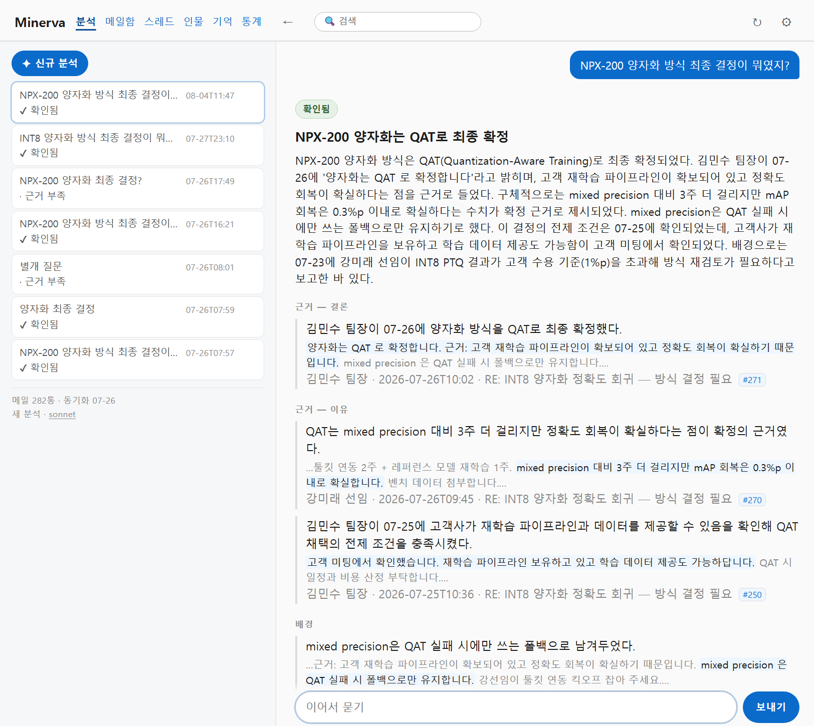
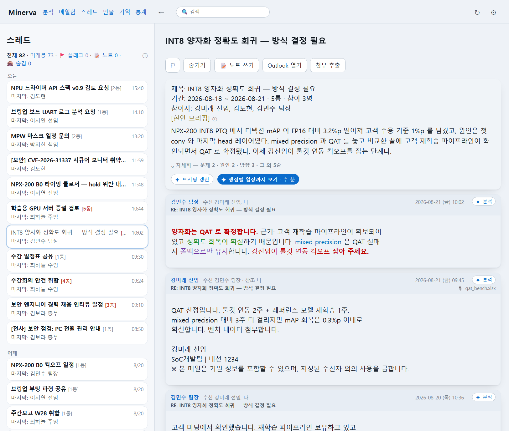
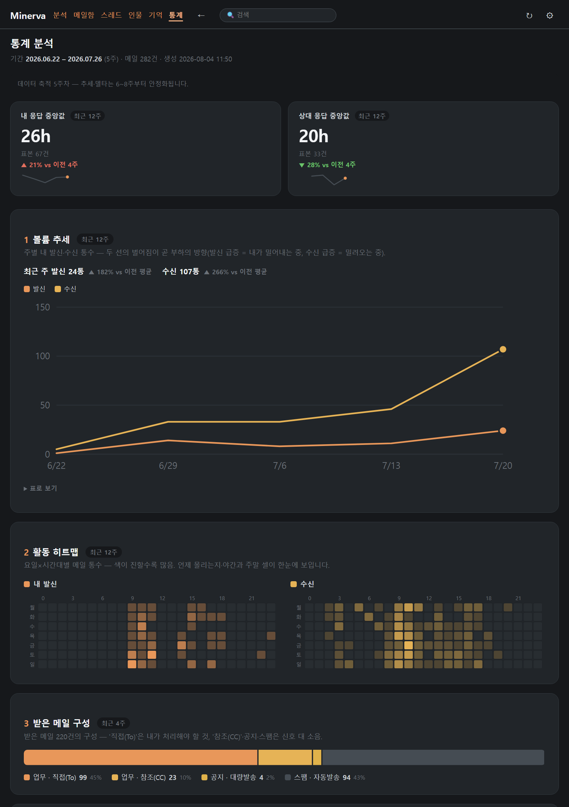

# mailkb — Outlook 메일을 AI 로 읽고, 결정을 기억한다

> **EN** — *mailkb* ("Minerva") is a personal knowledge layer on top of classic Outlook (COM, Windows):
> it indexes mail into SQLite/FTS5, serves an AI-assisted local web **reader** (read-only — sending
> stays in Outlook), distills daily decisions into a human-approved long-term ledger, answers questions
> with code-verified quotes, and ships a Claude Code skill for deep analysis —
> **Python stdlib only**, AI strictly opt-in via CLI subprocess. Korean-first.

## "그래서 그 결정 뭐였지?"에 근거를 달아 답한다

업무 메일은 조직의 결정이 실제로 일어나는 곳인데, 메일 클라이언트는 그것을
기억해 주지 않는다. mailkb 는 **수·발신은 Outlook 에 그대로 두고 읽기를 로컬 웹으로
가져와**, 쌓인 메일을 검색하고 AI 와 함께 읽고, 암묵지를 사람이 승인해 지식(md)으로 남긴다.

- **읽기** — 로컬 웹(Minerva)에서 메일함·스레드·인물·검색을 보고, 화면마다 AI 가
  붙는다(현안 브리핑 · 인물 프로필 · 쟁점 분석 · AI 검색). **읽기 전용**이다 —
  답장·보관·규칙은 Outlook 그대로
- **추출** — 하루 끝 회고가 결정과 암묵지 후보를 캐고, **사람이 승인한 것만**
  지식(md)이 된다. 주간 보고는 내가 관여한 사안을 토픽별로 묶는다
- **심화** — `/mail-research`(Claude Code 스킬): 재료는 mailkb 가 확보하고 분석은
  세션이 직접 한다. 앱의 답이 모자랄 때 쓰고, 처음부터 써도 된다

이 셋을 떠받치는 원칙은 세 가지다.

- **근거는 코드가 검증한다** — AI 가 댄 인용은 원문과 대조해 통과한 것만 남는다.
  환각을 프롬프트가 아니라 실행 경로에서 막는다
- **Python 표준 라이브러리만** — Windows 에서 `pywin32` 하나 추가, `pip install` 없음
- **AI 는 opt-in** — 안 쓰면 네트워크 호출이 0이다. 호출은 `claude` 같은 CLI 에
  subprocess 로 위임하므로 SDK 도 API 키도 없다



*(합성 데모 데이터 — 가상 팹리스 '누리소프트'의 1개월치 메일 약 280통. 실제 조사
결과이고, 근거마다 **진한 부분이 모델이 지목한 인용**, 흐린 앞뒤가 코드가 원문에서
그대로 떼어 붙인 문맥이다. 인용은 원문과 대조해 통과한 것만 남는다)*



*(읽기 전용 웹. 스레드 머리의 **현안 브리핑**은 [현안 브리핑] 버튼 한 번(AI 1콜)으로
그 자리에서 생긴다 — 첫 문장만 펼쳐 두고 문제·원인·방향은 접는다. 쟁점별 입장까지
필요하면 옆의 [쟁점별 입장까지 보기]가 조사를 더 돌린다(수 분). 답장·보관은 Outlook 에서)*

## 내 메일은 어디로 가나

- **서버는 `127.0.0.1` 고정이다.** 원격 바인딩 옵션이 아예 없다 — 다른 기기에서는
  열리지 않는다.
- **밖으로 나가는 것은 AI 호출뿐이다 — 예외 없음.** 그 호출도 SDK·API 키가 아니라
  `claude` 같은 CLI 에 stdin/stdout 으로 위임한다. 뉴스레터의 원격 이미지조차 서버가
  받아오지 않는다(사용자가 [위험을 감수하고 보기]를 누른 화면에서 브라우저가 직접
  받는다). 테스트가 서버 코드에 아웃바운드 소켓이 되살아나는 것을 막는다.
- **AI 를 안 쓰면 네트워크 호출이 0이다.** 수집·검색·회고·웹 UI 는 전부 로컬이다.
- **숨긴 스레드(`hide`)는 AI 프롬프트에 실리지 않는다** — 회고·암묵지 수확·분석·
  검색·인물 요약 전부. 사용자가 그 스레드에서 직접 [분석]을 누른 경우만 예외다.
- 데이터는 `data/` 한 폴더(SQLite + md)에 있다. 계정도 서버도 없고, 그 폴더를 지우면
  그걸로 끝이다.

## 시작하기

### 먼저 5분만 돌려 보기 — 데모

Outlook 도 Windows 도 필요 없다. Python 3.11+ 만 있으면 되고
**설치할 패키지가 없다.** 실제 사서함 대신 합성 코퍼스를 쓰므로 회사 PC 가
아니어도 화면과 회고·분석을 전부 볼 수 있다.

```bash
git clone https://github.com/dongjinpark-maker/mailkb
cd mailkb
python -m mailkb --home ./demo init       # 실사용 홈(data/)과 별개
```

(명령은 Windows 기준이다. 리눅스·macOS·WSL 은 `python` 대신 `python3`.)

**`demo/config.toml` 에 이 두 줄이 있는지 확인한다** — 저장소에 이미 들어 있다.
합성 코퍼스의 '나'를 알려주는 값이라 **바꾸지 않는다**(회사 PC 실사용 홈에서는
본인 주소로 채운다). 수집할 때 소비되므로 `sync` 전에 있어야 한다:

```toml
my_addresses = ["dohyun.kim@nurisoft.co.kr", "dhkim@nurisoft.co.kr"]
my_names     = ["김도현"]
```

이제 메일을 넣고 열어 본다. 여기까지 **AI 호출 0회**다.
(뭔가 안 되면 `python -m mailkb --home ./demo doctor` — 설정·DB·AI 경로를 짚어 준다)

```bash
python -m mailkb --home ./demo sync --source fake --full    # 1초 내
python -m mailkb --home ./demo review                       # 일간 회고
python -m mailkb --home ./demo serve --open                 # 웹 UI
```

보이는 것 — 회고에 **내 약속 6건**(내가 "하겠습니다"라고 쓴 문장을 인용과 함께),
미답변 46건, 웹에서는 메일함·스레드·인물·기억·통계. 코퍼스는 약 280통/170스레드에
긴 스레드(12–14통)·스팸·시스템 알림·답 없이 멈춘 스레드를 일부러 섞어 두었다. 날짜는 **실행일
기준 상대값**이라 회고의 "오늘"이 언제 돌려도 비어 있지 않다(대신 통수가 조금씩 다르다).

**AI 기능까지 보려면** `demo/config.toml` 의 `[ai.backends.*]` 에 쓰는 CLI 를
지정하고 `--ai` 를 붙인다.

```bash
python -m mailkb --home ./demo review --ai
python -m mailkb --home ./demo ask '양자화 최종 결정 뭐였지?'
```

> **데모를 새 코드로 다시 만들 때** — `sync --full` 은 이미 있는 메일(Message-ID
> 기준)을 건너뛰므로 본문 생성 규칙이 바뀌어도 기존 데모에는 반영되지 않는다.
> `demo/db.sqlite` 를 지우고 다시 `sync` 해야 한다. 그 파일에 쌓인 **분석 기록·
> 지식 후보 이력·플래그는 함께 사라지니**, 남길 것이 있으면 먼저 복사해 둔다.

### 실사용하려면 — 이 PC 에서 되는가

| 조건 | 왜 | 아니면 |
|---|---|---|
| Windows + **클래식** Outlook 데스크톱 | COM 으로 사서함을 읽는다. 실행 파일이 **`outlook.exe` 면 클래식**, `olk.exe` 면 새 Outlook 이고 새 Outlook 에는 COM 이 없다. 새 Outlook 이 떠 있다면 제목 표시줄의 '새 Outlook' 토글을 꺼서 클래식으로 돌아갈 수 있다 | **위 데모만** 가능 |
| Windows 네이티브 **Python 3.11+** | `tomllib` 을 쓴다. **WSL 로는 안 된다** — COM 이 안 붙는다 | 설치 불가 |
| `pip` 로 **pywin32** 설치 가능 | 사서함을 읽는 유일한 외부 패키지. 프록시 뒤라면 `--proxy` 로 | **수집과 원문 열기만** 불가 (이미 모은 메일이 있으면 검색·회고·웹 UI 는 된다) |
| `git` 또는 ZIP 다운로드 | 받기·업데이트에 쓴다. git 이 없으면 GitHub 의 **Code › Download ZIP** 으로 받고, 업데이트도 다시 받는다 | 설치 불가 |
| `claude` (또는 사내 CLI) 가 PATH 에 | 내장 백엔드가 `claude -p --model sonnet` 이다 | **AI 만 빠지고 나머지는 다 된다** |

앞의 셋이 안 되면 실사용은 못 한다 — **위 데모는 이 조건과 무관하게 돈다.**

**나머지는 `doctor` 가 확인한다** — 받은 뒤 `python -m mailkb doctor` 를 돌리면
보안 설정·계정·폴더 범위·설정 누락을 한 번에 짚고, 실패마다 처방을 함께 낸다.

### 회사 PC 에 설치 — 실사용

PowerShell 에서 아홉 줄이다. **`doctor` 를 두 번 돌리는 것이 요지다** — 한 번은
환경을 보려고, 한 번은 설정을 채운 뒤 맞는지 보려고.

```powershell
git clone https://github.com/dongjinpark-maker/mailkb
cd mailkb
pip install pywin32
python -m mailkb init                   # 코드 폴더 옆에 data\ 생성
python -m mailkb doctor                 # ① 환경 점검 + 내 Outlook 계정 주소 확인
notepad data\config.toml                # ②  그 주소를 my_addresses 에 (아래 주의)
python -m mailkb doctor                 # ③ '메일 수집 ● 통과' 인지 확인
python -m mailkb sync --since (Get-Date).AddMonths(-6).ToString("yyyy-MM-dd")
python -m mailkb serve --app            # Edge 앱 모드(창을 닫으면 서버도 종료)
```

`doctor` 는 맨 위 네 줄로 **무엇이 되고 무엇이 안 되는지**부터 답한다.

```
  ● 통과  메일 수집          됩니다
  ● 통과  Outlook 원문 열기  됩니다
  ▲ 주의  검색·회고·웹 UI    아직 수집한 메일이 없습니다
  ▲ 주의  AI 기능            쓸 수 있는 백엔드가 없습니다
```

**①에서 Outlook 계정 주소를 알려 주므로** ②에서 그대로 넣으면 된다. 보안 경고가
뜨면 [허용]을 누른다 — 그 팝업이 여기서 뜨는 것 자체가 점검 결과다. 수집이 20분
돈 뒤에 같은 곳에서 막히는 것보다 낫다. AI 호출은 없다.

①에서 `my_addresses` 가 **실패로 뜨는 것은 정상이다** — 아직 안 채웠으니까.
①에서 볼 것은 `[Outlook]` 절이고, `my_addresses` 는 ③에서 통과하면 된다.

**설정 편집이 `sync` 보다 먼저인 것이 중요하다.** `my_addresses` 는 **수집할 때
소비되는** 값이라 나중에 채우면 발신 판정이 안 돼 회고·미답변·내 약속이 전부 비어
보이고, 고치려면 재수집해야 한다. ③이 이걸 확인해 준다.

**규칙으로 메일을 자동 분류하고 있다면** — 받은 편지함 **하위 폴더까지** 수집하는
것이 기본이다(지운 편지함·정크는 항상 제외). `doctor` 의 `[폴더 범위]` 절이 어떤
폴더를 몇 통씩 훑을지 미리 보여 주고, 빼고 싶은 폴더는 웹 **설정 › 수집 폴더**
에서 끌 수 있다. 이 값이 꺼져 있으면 규칙으로 분류된 메일은 색인에 **아무 표시
없이** 안 들어온다.

**6개월은 예시다.** 인물 화면이 최근 6개월 교류를 창으로 쓰므로 그만큼이면 모든
화면이 채워지고, 1년이든 그 이상이든 넣어도 동작에는 문제가 없다 — 첫 수집 시간과
DB 크기만 늘어난다(연 200–300MB, 아래 '백업'). 첫 수집은 사서함 크기와 폴더 수에
따라 수 분에서 수십 분이고, 이후 `sync` 는 증분이라 빠르다. `--since` 없이 돌리면
사서함 전체를 가져온다. (cmd.exe 라면 날짜를 직접 적는다: `--since 2026-02-01`)

`data/` 는 gitignore 라 이후 `git pull` 이 실데이터·설정을 건드리지 않는다.
설정 항목별 의미, 자동 동기화 등록(`schtasks`), 아이콘 실행은
**[docs/DEPLOY-WINDOWS.md](docs/DEPLOY-WINDOWS.md)** 에 있다.

### 설치를 Claude Code 에게 시키기

회사 PC 의 **빈 작업 폴더**에서 Claude 세션을 열고 아래를 그대로 붙여 넣는다
(저장소를 아직 안 받았어도 된다 — 받는 것부터 시킨다).
**설정값을 대신 채우지 못하게** 하고 **수집 전에 확인을 받게** 하는 것이 요지다.

````markdown
mailkb 를 이 PC 에 설치하려고 한다. 아래 순서대로 하고 **6번에서 반드시 멈춰라.**

1. git clone https://github.com/dongjinpark-maker/mailkb
   (git 이 없으면 GitHub 의 Code > Download ZIP 으로 받아 풀어라)
   그 폴더로 들어가 README.md 와 docs/DEPLOY-WINDOWS.md 를 읽어라.
2. pip install pywin32
3. python -m mailkb init
4. python -m mailkb doctor — 결과 전체를 보여 줘. 맨 위 네 줄과 [Outlook] 절이
   중요하다. **[Outlook] 절에 '■ 실패'가 있으면 거기서 멈춘다**(각 줄에 처방이
   붙어 있다). [설정] 절의 my_addresses 실패는 아직 안 채워서 그런 것이니
   정상이다 — 6번에서 고친다. Outlook 보안 경고가 뜨면 나에게 알려 줘 —
   내가 [허용]을 누른다. (이 단계는 종료 코드가 1이어도 정상이다)
5. doctor 의 [Outlook] MAPI 계정 줄에 내 메일 주소가 있다. 그 값을 알려 줘.
6. **여기서 멈춘다.** data\config.toml 의 my_addresses · my_names ·
   internal_domains 는 내 실제 값이다. 5번에서 본 주소를 후보로 제시하되
   **별칭 주소와 이름은 네가 지어내지 말고 물어봐.** 내가 넣었다고 답하면 7번.
7. python -m mailkb doctor 를 다시 돌려 '메일 수집 ● 통과' 인지 확인해 줘.
   [폴더 범위] 절에 하위 폴더가 몇 개 잡히는지도 알려 줘.
8. 최근 6개월을 수집한다(기간은 예시 — 더 길게 잡아도 된다). **사서함을 읽는
   작업이니 실행 전에 확인을 받아라.**
   python -m mailkb sync --since (Get-Date).AddMonths(-6).ToString("yyyy-MM-dd")
9. python -m mailkb serve --app 로 띄우고 화면이 뜨면 알려 줘.

설치 과정에는 AI 호출이 없다(init·doctor·sync·serve 는 네트워크 호출 0).
ask 와 diagnose 는 그 자체가 AI 명령이니 내가 요청할 때만 실행해라.
````

## AI 를 켤 때 알아 둘 것 셋

- **AI 에게 줄 지침은 `data/ai-rules.md`** 에 쓴다(데모 홈이면 `demo/ai-rules.md` —
  사용자 홈이 아니라 **데이터 폴더**다). `init` 이 주석만 든 템플릿을 만들어 두니
  열어서 형식을 보고 주석 밖에 평문으로 적는다 — HTML 주석은 AI 가 보지 않고,
  저장하면 다음 호출부터 반영되며, 4,000자에서 잘린다. 사내 용어 풀이·호칭·우선순위
  같은 것이 들어갈 자리이고, 회고의 암묵지 수확·**분석·주간 보고**에 실린다. 인용을
  검증하는 단계에는 안 들어간다. AI 가 실제로 보는 지침·노트·지식은
  `ask --context '<질문>'` 으로 확인한다.
- **분석이 한 번에 싣는 입력량**은 `[ai] ask_max_input_tokens` 로 정한다
  (기본 120000 — Claude 기준, 0=제한 없음). **값은 곧 백엔드 컨텍스트 창**이고,
  통당 배분은 코드가 알아서 한다 — 3통만 읽으면 사실상 전문을, 24통을 읽으면
  그만큼 나눠 싣는다. 사내 백엔드 창이 작으면 그 값으로 낮춘다.
- **`[ai.backends.<이름>] effort_flag = "--effort"`** 를 선언하면 어려운 콜에
  추론 강도를 붙인다. 선언하지 않는 것이 기본이고, 그때는 아무것도 안 붙는다 —
  CLI 가 그 플래그를 지원하는지 `diagnose` 로 먼저 확인하고 켠다.

## 웹 UI — Minerva

`mailkb serve` 는 Outlook 처럼 **좌/우로 나뉜** 로컬 웹 앱이다. 왼쪽이 목록,
오른쪽이 읽기 패널이고, 브라우저가 렌더를 맡으므로 OS 를 타지 않는다.

| 메뉴 | 무엇을 하나 |
|---|---|
| **분석** (첫 화면) | 질문하면 메일을 찾아 읽고, 인용을 원문과 대조해 근거 달린 답을 쓴다 — 한 줄 결론 · 경위 · 근거(원문 앞뒤 문맥까지) · 열린 것. 이어 묻기와 인물 브리핑 |
| **메일함 · 스레드** | 읽기 전용 메일함 — 필터 탭 · 키보드 이동 · 자동 동기화 · 메일별 [분석]. 스레드 머리의 **[현안 브리핑]**(AI 1콜)과 쟁점 분석, 발신인 옆 관계 배지, 스레드당 **내 노트**(md 파일 — 검색과 AI 문맥에 반영) |
| **인물** | 한 사람을 한 화면에 — **현안 브리핑**(1콜) · **심층 분석**(조사 라운드) · **프로필**(맡은 일 · 일하는 방식 · 자주 같이 있는 사람), 그리고 관계 수치 · 이 사람에게 한 내 약속 · 업무 어휘 지도 |
| **기억** | 일간 회고 · 주간 보고 · **지식**. 회고가 캐낸 암묵지 후보를 [지식으로 저장]하면 `vault/knowledge/` 에 md 로 남고 검색과 분석 문맥에 실린다 |
| **설정** | 테마 · 판정 기준 · 수집 폴더 · 차단 발신인 · 노이즈 규칙 · 역할별 AI 백엔드와 **AI 백엔드 상태**([응답 시험]이 모델을 실제로 불러 본다) · 최신으로 업데이트 |
| **통계** | 응답 중앙값(나/상대) · 볼륨 추세 · 활동 히트맵 · 받은 메일 구성 · 왕복 많은 논의 · 기억 커버리지 |

다크 모드도 같은 화면이다. 통계는 "지금 부하가 어느 쪽으로 기울었나"만 답하도록
추린 것이라 지표가 여섯뿐이다 — 세어서 재미있는 값이 아니라 **보고 나면 뭘 할지가
나오는 값**만 남겼다.



보안: 의존성 0의 stdlib `http.server`, **localhost 바인딩만**, CSP로 원격 이미지
(추적 픽셀)와 인라인 스크립트 차단, POST Origin 검사. 원격 이미지는 [위험을
감수하고 보기]를 누른 그 화면에서만 풀리고 **서버는 대신 받아오지 않는다** —
받는 것은 브라우저다(서버가 여는 아웃바운드 소켓은 없다).

화면별 상세와 키보드 단축키는 [docs/ARCHITECTURE.md](docs/ARCHITECTURE.md)에 있다.

## 명령

| 명령 | 하는 일 | AI |
|---|---|---|
| `sync [--full]` | 증분 수집 + 인용 제거 + 파생 갱신 | ✗ |
| `ls [--unanswered\|--today]` | 목록 / 미답변 스레드 | ✗ |
| `search <질의> [--json --ai]` | 전문검색 (연산자 DSL 지원) | 선택 |
| `show <번호>` · `thread <ID>` | 본문(인용 제거본) · 스레드 타임라인 | ✗ |
| `ask <질문> [--follow --person]` | **분석** — 근거 달린 답 | ✓ |
| `ask --history` · `--show <번호>` · `--context <질문>` | 저장된 분석 열람 · 엔진이 실을 지침·노트·지식 보기 | ✗ |
| `review [--ai]` | 일간 회고 → vault/daily | 선택 |
| `weekly [--weeks 1 --ai]` | 원문 근거 기반 주간 보고 → vault/weekly. `--ai` 는 3콜이고 **주당 8~13분** | 선택 |
| `note <스레드ID>` | 지식 노트 템플릿 생성 — 웹에선 스레드 화면에서 바로 쓰고, 검색·AI 문맥에 반영 | ✗ |
| `audit` · `noise` · `stats` | 분류 감사 · 발신자 분포 · 저장소 통계 | ✗ |
| `doctor` | **사전 점검** — 환경·Outlook·수집 폴더 범위·설정·DB·AI 경로. 수집 전에 30초로 '이 PC 에서 되는가' 를 답한다 | ✗ |
| `diagnose [--backend]` | 진단 — 스레딩·본문품질(인용 절단 실패 의심·재절단 백업)·요약 커버리지·**AI 백엔드 시험 호출**(역할이 쓰는 백엔드마다 1회 — 기본 설정이면 sonnet·opus 둘. `--backend` 로 하나만) | ✓ |
| `block` · `unblock` · `hide` | 발신자 제외 · 스레드 숨김(목록·추적·**AI 프롬프트**에서 제외) | ✗ |
| `open <번호>` · `attach <스레드ID>` | Outlook 원문 열기 · 첨부 추출 (Windows) | ✗ |
| `serve [--port --open --app]` | Minerva 웹 UI | ✗ |

전체 옵션은 `python -m mailkb <명령> --help`.

## 더 읽을 것

| 문서 | 내용 |
|---|---|
| [docs/ARCHITECTURE.md](docs/ARCHITECTURE.md) | **목적·구조·데이터 모델·파이프라인·기능 상세·설계 결정** |
| [docs/DEPLOY-WINDOWS.md](docs/DEPLOY-WINDOWS.md) | 회사 PC 배포 상세 |
| [CLAUDE.md](CLAUDE.md) | AI 코딩 에이전트용 작업 규칙·불변식 |
| [agent-guides/](agent-guides/) | 조사 에이전트용 CLI 계약 |
| [.claude/skills/mail-research/](.claude/skills/mail-research/) | Claude Code 스킬 — `/mail-research` (위 계약을 그대로 따른다) |
| [docs/REVERTED-quote-diff.md](docs/REVERTED-quote-diff.md) | 되돌린 실험 하나의 기록 — 다시 시도할 때의 함정 목록 |

## AI 에이전트에게 조사를 맡기려면 — `/mail-research`

mailkb 는 사람이 웹으로 쓰는 도구이면서, **에이전트가 CLI 로 쓰는 도구**이기도
하다 — 어떤 명령이 읽기 전용이고 어떤 것이 AI 를 부르는지, 인용을 어디서 대조하는지를
계약 문서(`agent-guides/`)로 적어 두었다.

**Claude Code 라면 저장소에서 `/mail-research` 한 번이면 된다**
(`.claude/skills/mail-research/`). 재료 확보는 mailkb 조회 명령으로 하고 **분석은
세션이 직접 한다** — 웹 분석(`ask`, 최대 12콜)의 고정 파이프라인을 넘는 심화
분석용이다. 인용·기한
규율과 결과 보존(스레드 노트·지식 md — 실질이 있을 때만 제안)까지 계약
(`agent-guides/`)에 들어 있다.

```
/mail-research NPX-200 양자화 최종 결정이 뭐였지?
```

흐름은 이렇다: 질문 해부 → **이미 분석된 것 확인**(`ask --history`, 있으면 그것이
못 간 지점부터) → `search --json`·`show`·`thread` 로 확보(AI 0콜) → 반전 신호
검색·인용 대조를 거쳐 **세션이 직접 분석** → 근거 달린 답 → 실질이 있을 때만
보존 제안. 상세 계약은 `agent-guides/minerva-researcher.md`.

다른 도구를 쓴다면 계약 문서를 직접 읽힌다 — `agent-guides/` 의 둘
(`minerva-researcher.md` · `minerva-cli-reference.md`)이 **권한·절차 계약**이고,
읽히지 않으면 아무 효력이 없다.

```
agent-guides/minerva-researcher.md 와 agent-guides/minerva-cli-reference.md 를
먼저 읽고 그 계약대로 조사해줘. 저장소 루트에서 python -m mailkb 로 실행하고,
승인 없이 실행해도 되는 조회 명령만 써. 질문: "NPX-200 양자화 최종 결정이 뭐였지?"
```

핵심은 **어떤 명령이 AI 를 부르는지**다 — `ask`·`diagnose`는 플래그 없이도
호출하므로 계약이 사용자 명시 요청으로 좁혀 둔다. 조사는 `search --json` · `show` ·
`thread` 로 확보하고 분석은 에이전트가 직접 한다.

## 백업

데이터 폴더(`<mailkb>/data` — `db.sqlite` + `config.toml` + `vault/`) 복사 한 번.
연 200–300MB 수준이다.

메일 본문은 Outlook 에 있으니 `sync`로 다시 만들어지지만, **`db.sqlite`에는 재수집으로
복구되지 않는 것도 들어 있다** — 지식 후보의 저장/유보 이력 · 분석 이력 · 인물 요약 ·
신호 해제 · 플래그/숨김 · 리포트에서 "처리함"으로 접은 항목. 그래서 이 파일
삭제는 백업 없이 되돌릴 수 없다.

**뒤집어 말하면 이게 유일한 삭제 수단이기도 하다.** 색인에서 특정 메일만 지우는
기능은 아직 없다(설계 조사는 [ARCHITECTURE §12](docs/ARCHITECTURE.md)). 민감한
내용이 들어왔다면 `data/` 를 지우고 다시 수집하거나, 애초에 그 폴더·발신자를
수집에서 빼 둔다(설정 › 수집 폴더 · `block`).

## 라이선스

MIT — [LICENSE](LICENSE) 참고.
